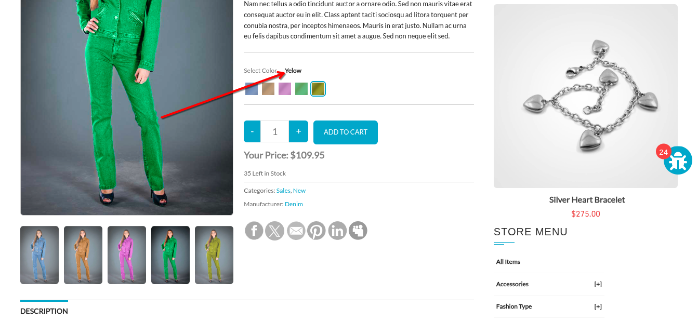
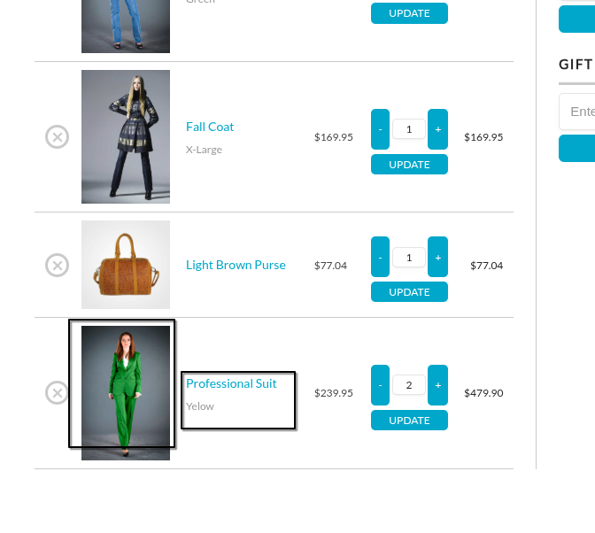

### Note  
This bug was not mentioned in the site as of writing this report on `2025-12-24_122720`    

--- 

#### Title
Mismatched Product Color Selection in Cart  

#### Severity
Medium to High based on context   
**High impact on user trust and order accuracy**
#### Description  
A user can select color `x` from the product details photo and color `y` from `Select Color` options in product details page.
This creates a confusion when the product is shown in the cart. 

#### How to Reproduce
- Select a product that has multiple color choice e.g. `Denim Coat`
- Select a `Green` item from bottom of the model photo
- Select `Yellow` from `Select Color` option  
- Click `Add to Cart` button 
- Observe the output
#### PoC  
- Selecting two different colors in product details page 

- The output in the cart  

 
#### Expected Result
The selected product color and `Select Color` options should matched and validated before adding to Cart. 

#### Impacts
**User Confusion:** Customers are unsure which color they will actually receive.  
**Logistics Errors:** Increases the rate of returns and customer support tickets due to "wrong item received" complaints.